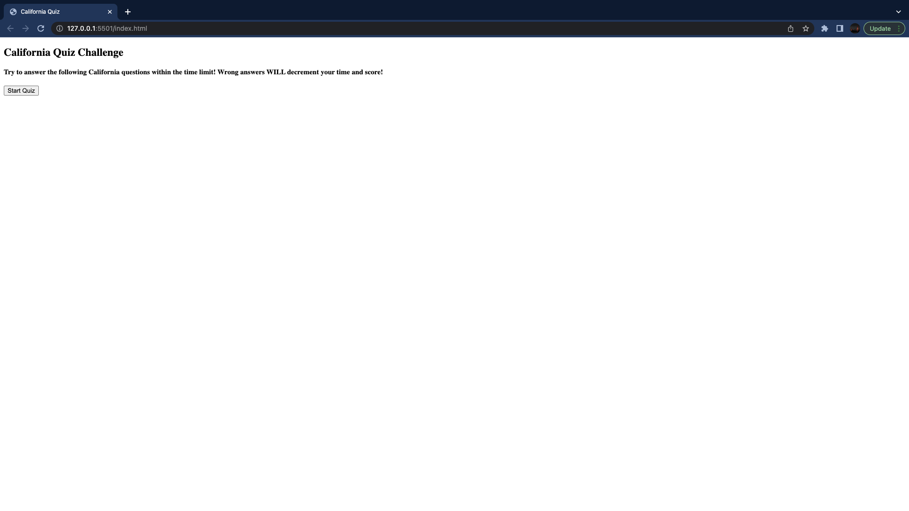
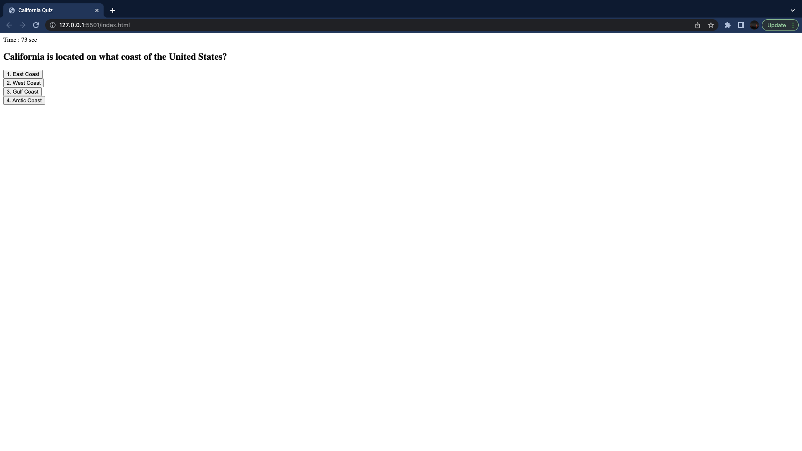
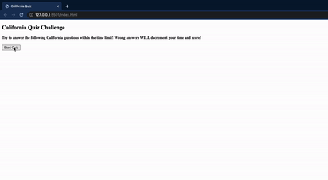
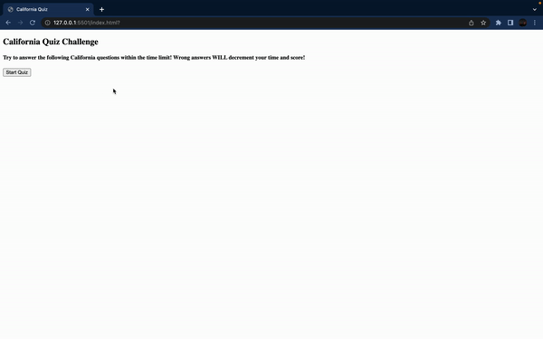

# Homework 4: Code Quiz

## Description

For this week's homework, we were assigned to create a quiz from scratch using HTML and Javascript (CSS optional). Although there's not a lot of styling, I'm just happy the quiz actually works! Since the quiz content can be whatever it can be, I decided to create a quiz about the state of California as I lived there for most of my life.

As always, here is the **User Story** and **Acceptance Criteria**:

## User Story

```
AS A coding boot camp student
I WANT to take a timed quiz on JavaScript fundamentals that stores high scores
SO THAT I can gauge my progress compared to my peers
```

## Acceptance Criteria

```
GIVEN I am taking a code quiz
WHEN I click the start button
THEN a timer starts and I am presented with a question
WHEN I answer a question
THEN I am presented with another question
WHEN I answer a question incorrectly
THEN time is subtracted from the clock
WHEN all questions are answered or the timer reaches 0
THEN the game is over
WHEN the game is over
THEN I can save my initials and my score
```

## Installation

I've provided my Github Repo and Github Pages to this project to see if you know some information about California:
- Github Repo: https://github.com/jasonchun7/hw-4-codequiz
- Github Pages: https://jasonchun7.github.io/hw-4-codequiz/

## Usage

The UI and UX is as simple as it gets, with the quiz content and all of its texts on the left side of the screen by default. 

The landing page shows information that let's you know the quiz is about California, and that wrong answers will decrement your time (by 10 seconds) and your score:



Once you click 'Start Quiz', then the timer starts at the top left, and the first question and the list of buttons show for your choices:



As shown, the timer starts at 75 seconds. With only 4 questions, you have slightly more than 15 seconds to answer each question (not that you would need it!).

If you choose the correct answer, then the timer continues with no decrements, but if your answer is wrong, then the timer decreases by 10 seconds:



Once the quiz is complete, then you are shown your final score, and a text box to include your initials. Once you click on Submit, then you're taken back to the start page:



## Credits

As mentioned in my previous homework, strangely (maybe not), I'm having trouble understanding the Javascript code and it's functions/methods compared to what seems like simple HTML and CSS. Hence, I've referenced and researched a lot of my code from Gauri Khandke from her Github Repo. Here is her link:
- https://github.com/GauriKhandke/Gauri-code-quiz